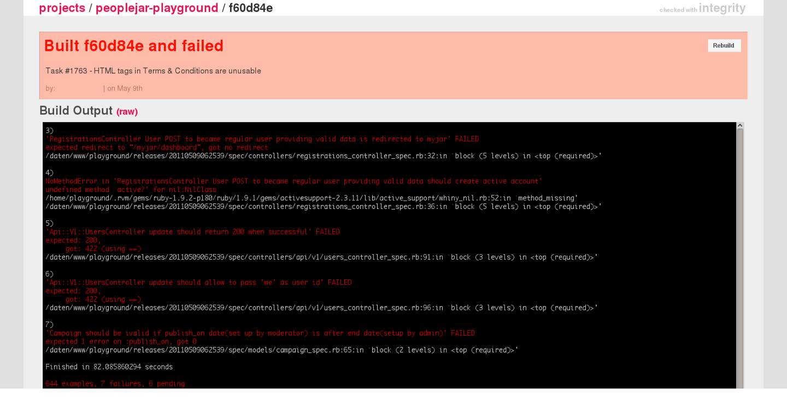

!SLIDE full-page

## Tests documentation and failure messages ##

<pre class="console">
$ rspec -f doc spec/models/campaigns_spec.rb

Campaign
  should be visible by default
  should have performances visible by default
  should not be published at start
  should not be ready to publish at start - without performances, etc
  #allowed_performance_kinds
    should allow all by default
    
Failures:

  1) Campaign should not be ready to publish at start - without performances, etc
     Failure/Error: campaign.should_not be_ready_to_publish
       expected ready_to_publish? to return false, got true
     # ./spec/models/campaign_spec.rb:23:in `block (2 levels) in <top (required)>'

Finished in 0.71323 seconds
5 examples, 1 failure
</pre>

!SLIDE full-page
### When tests output matter ###

